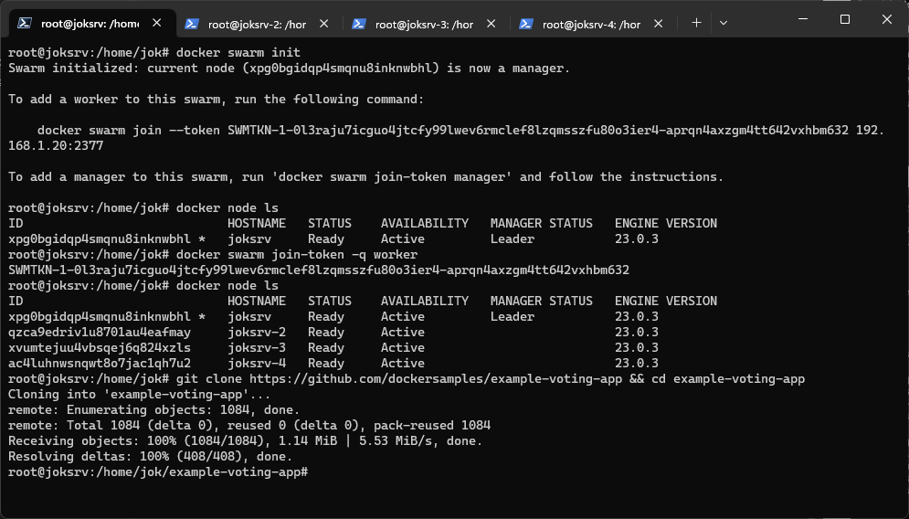

# Контейнеризация. ДЗ-5

**Сапунов А. Контейнеризация. Итоговая практическая работа.**

## Docker Compose и Docker Swarm

### Задание 

Проделать лабараторную ( https://bday2021.play-with-docker.com/voting-app/ ) с четырьмя нодами.
Посмотреть ```docker node ls```
Изучить какие сервисы запустились на каждой ноде.
"Уронить" (выключить) одну ноду.
Посмотреть ```docker node ls```

Прислать краткий отчет в pdf файле

### Ход выполнения

Подготовим четыре виртуальных сервера для организации нод.


Инициализируем на них docker swarm. Первый - лидером, остальные - воркерами


Выполним клонирование репозитория git.



Сделаем деплой 


Проверяем сервисы.


Выключим сервер с номером 3 (joksrv-3). И проверим состояние сервисов и нод.


Как видим статус ноды jokersrv-3 стал Down. А у сервисов изменилось состояние REPLICAS. Что говорит о перераспределении задач в кластере.
 
